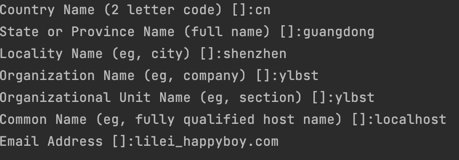

安装proto
go install google.golang.org/protobuf/cmd/protoc-gen-go@v1.28
go install google.golang.org/grpc/cmd/protoc-gen-go-grpc@v1.2

生成go文件
protoc --go_out=. --go_opt=paths=source_relative \
--go-grpc_out=. --go-grpc_opt=paths=source_relative \
helloWorld/proto/simple.proto

引入缺失的包
go mod tidy

#1
genrsa -out ca.key 2048

#2
req -new -x509 -days 3650 -key ca.key -out ca.pem

#3
genrsa -out server.key 2048

#4
req -new -key server.key -out server.csr

#5
x509 -req -sha256 -CA ca.pem -CAkey ca.key -CAcreateserial -days 3650 -in server.csr -out server.pem

ecparam -genkey -name secp384r1 -out  client.key

req -new -key client.key -out client.csr

x509 -req -sha256 -CA ca.pem -CAkey ca.key -CAcreateserial -days 3650 -in client.csr -out client.pem

问题描述
could not greet: rpc error: code = Unavailable desc = connection error: desc = "transport: authentication handshake failed: x509: certificate relies on legacy Common Name field, use SANs instead"

